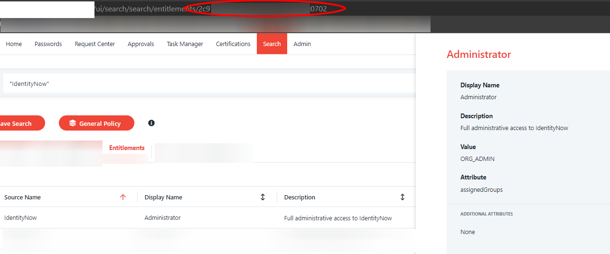

# IDN-AccessProfileManager
A GUI based tool to manage Access Profiles in SailPoint's IdentityNow tool. Depends on the CSharp-IDN-Helper repository.

This tool is designed to be as easy as possible to use. You will need to know your org-id, a client id, and a client secret. Your admin can get you these things.

Before getting started you will want to click under File >> Configuration and fill out the necessary fields.

To use the tool you will first enter in the Access Profile ID next to where it says "Load Entitlements". You can find the Access Profile ID in the GUI and navigating to the Access Profile you want to edit. The ID is in the URL: <org-name>.identitynow.com/ui/admin#admin:access:access-profiles:<ACCESS PROFILE ID>
  
When you click "Load Entitlements" the form will populate and you can enter in Entitlment IDs into the Remove or Add Entitlement boxes. Finding the entitlement IDs for the ones you want to remove is easy. Try clicking on the ID of the entitlement in the data grid and notice how the ID automatically copies to your clickboard. Once you copy the Entitlement ID into the text box above "Remove Entitlement" the Access Profile should update.

Adding Entitlements takes an extra step. You'll need to find the entitlement ID. I have found Search to be perfect for this. You can search for the name of the entitlement (be sure to put the name in quotes) and select the appropriate entitlement and capture the ID in the URL much like the Access Profile. See the attached image.

You can validate the change to the Access Profile by clicking "Load Entitlements" again.

This tool is far from perfect. It does very little error correction and needs some extra hands to make it better. However, it has served well by making AP updates FAR easier than using Postman or other APIs. 
